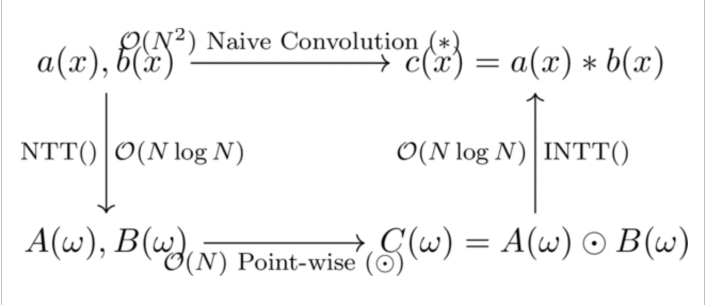

# Fully Homomorphic Encryption in Rust
## GSW, Ring-GSW, and TFHE Bootstrapping

**Author:** Jakob Tønseth Gjeruldsen
**Course/Project:** Cryptography and Security Protocols

---

# 1. Introduction to Fully Homomorphic Encryption

- **The Goal:** Compute on encrypted data without decrypting it.
- **The Problem:** Operations add "noise" to ciphertexts. Too much noise corrupts the data permanently.
- **This Project Implements:**
  - **GSW (Gentry-Sahai-Waters):** Standard LWE-based Homomorphic Encryption.
  - **Ring-GSW:** Polynomial-based FHE for better packing and smaller keys.
  - **Bootstrapping:** TFHE-style blind rotation to clear noise.
  - **Lattice Attack:** Mathematical cryptanalysis of insecure parameters.

---

# 2. The GSW Scheme (LWE)

Implemented in `src/gsw/`

- **Concept:** Relies on the **Approximate Eigenvector** method. 
  - Secret Key Vector: $\vec{v}$
  - Ciphertext Matrix: $C$
  - Message: $\mu$
  - $C \cdot \vec{v} = \mu \cdot \vec{v} + \vec{e}$ (where $\vec{e}$ is a small noise vector)
- **Operations:**
  - Addition $\rightarrow$ Matrix Addition (XOR)
  - Multiplication $\rightarrow$ Matrix Multiplication (AND)

---

# 3. The Gadget Matrix & Noise Management

Multiplying ciphertexts normally explodes noise exponentially: $(E_1 \cdot E_2)$.

- **The Solution:** The Gadget Matrix ($G$) and Bit-Decomposition ($G^{-1}$).
- **How it works:** 
  - $G^{-1}$ flattens the ciphertext into a matrix of strictly `0`s and `1`s.
  - $C_{prod} = C_1 \cdot G^{-1}(C_2)$
- **Result:** Multiplying by $\{0, 1\}$ turns an exponential noise blowup into a slow, linear accumulation. We can evaluate moderately deep circuits!

```rust
// Fast Bit-Decomposition in Rust (g_inverse)
z[(row * L + j, col)] = val & 1;
val >>= 1;
```

---

# 4. Ring-GSW (RGSW)

Implemented in `src/rgsw/`

- Moves from matrices of integers to matrices of **Polynomials** in $Z_q[X]/(X^N + 1)$.
- **Why?**
  - **Efficiency:** Drastically shrinks matrix dimensions from $(n \times n\log q)$ to $(2 \times 2\log q)$.
  - **Packing:** A single polynomial packs $N$ bits or integers.
  - **CRT Slots:** We use the Chinese Remainder Theorem to pack distinct values into "slots", allowing **SIMD** (Single Instruction, Multiple Data) addition and multiplication on arrays natively.

---

# 5. The Need for Bootstrapping

- Even with the Gadget Matrix, noise grows. 
- In our demo: Evaluating `res = (m1 AND m2) AND m3` causes cascaded multiplication error.
- **Result from Demo:** 
  - *Target Phase:* 8,589,934,592
  - *Noisy Phase:* 8,589,999,813
  - *Accumulated Error:* **65,221**
- If we continue evaluating gates, the error will overflow, and decryption will fail.

---

# 6. TFHE / AP14 Blind Rotation (Bootstrapping)

Implemented in `src/bootstrapping/`

- **Concept:** Evaluate the decryption circuit *homomorphically*.
- **Blind Rotation:** 
  - We map the noisy LWE phase into the exponent of a "Test Polynomial" (a step-function lookup table).
  - We use the Bootstrapping Key (RGSW encryptions of the LWE secret bits) as a homomorphic multiplexer (CMUX) to conditionally rotate the polynomial.

```rust
// The core CMUX operation per bit
let acc_rotated = acc_multiply_by_x_power(&current_acc, -a_i);
let acc_diff = subtract_matrices(&acc_rotated, &current_acc);
let selector = homomorphic_mul(&bk_i, &acc_diff);
current_acc = homomorphic_add(&current_acc, &selector);
```

- **Result:** The noise is rounded away, and we extract a fresh ciphertext!

---

# 7. Bootstrapping Results

After running the highly degraded ciphertext through the Bootstrapping module:

- **Before:** Accumulated Error = 65,221
- **After:** Residual Error = 29,865

**Success!** The error was slashed by more than half, resetting the ciphertext's lifespan. (In a production system with larger parameters, this residual error is virtually zero).

---

# 8. Cryptanalysis: The Lattice Attack

Implemented in `src/attack.rs`

- We export the LWE public key matrix into a Python script.
- **Method:** Kannan's Embedding technique.
- We construct a lattice basis containing the public matrix $A$ and the modulus $Q$.
- Using **SageMath**, we run the **LLL** (Lenstra–Lenstra–Lovász) algorithm to solve the Shortest Vector Problem (SVP).
- **Result:** The script instantly recovers our private secret key vector ($\vec{s}$).

---

# 9. Why Did the Attack Work So Easily?

The system was completely broken because I used **"Toy Parameters"**.

- **LWE Dimension ($N=4$):** Lattice attacks scale exponentially against dimension. A 4-dimensional lattice is trivial for modern CPUs.
- **Massive Modulus vs. Tiny Noise:** Our noise was $\pm 1$, while $Q = 2^{24}$ (16.7 million). The hidden secret structurally stood out like a sore thumb.
- **Overdetermined System:** We provided $M=25$ equations to solve for $4$ unknowns.

*These parameters were chosen specifically so the demo could execute instantly on a local CPU.*

---

# 10. Future Work: Making it Secure

To achieve **128-bit security**, we must change `params.rs`:

1. **Increase LWE Dimension:** $N_{LWE} \ge 512$.
2. **Increase Ring-LWE Dimension:** $N \ge 1024$.
3. **Increase Samples:** $M \ge 12,288$ (Leftover Hash Lemma).

**The Engineering Challenge:**
Using an $O(N^2)$ polynomial multiplication algorithm with $N=1024$ takes billions of CPU cycles. We need the **Number Theoretic Transform (NTT)** to reduce complexity to $O(N \log N)$.

**NTT Commutative Map:**
By transforming polynomials into the NTT domain, costly polynomial convolution ($*$) becomes cheap element-wise multiplication ($\odot$):
$$ a(x) * b(x) = \text{INTT}(\text{NTT}(a) \odot \text{NTT}(b)) $$

---

# 11. NTT Commutative Diagram

The Number Theoretic Transform (NTT) provides a shortcut to bypass the expensive $O(N^2)$ polynomial convolution:



**Total NTT Complexity:** $O(N \log N) + O(N) + O(N \log N) = \mathbf{O(N \log N)}$
**Naive Complexity:** $\mathbf{O(N^2)}$

*For secure parameters like $N = 1024$, this drops operations from over 1,000,000 to roughly 10,000!*

---

# 12. Conclusion


- Successfully implemented standard GSW logic (Addition/Multiplication).
- Transitioned to Ring-GSW for polynomial packing and CRT slots.
- Achieved true Fully Homomorphic Encryption via Bootstrapping/Blind Rotation.
- Demonstrated parallelization using Rayon and robust testing with Proptest.
- Verified cryptographic limits using a real-world SageMath Lattice attack.

### Thank You!

